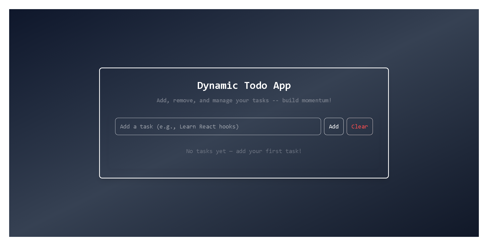
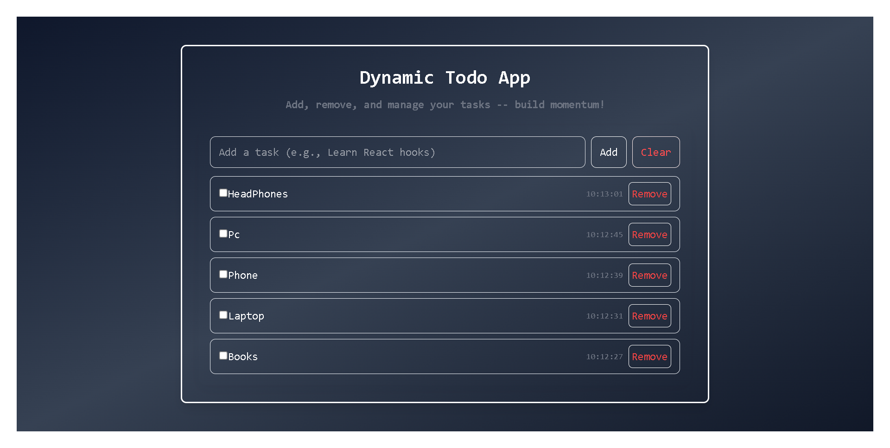

# 🧠 Dynamic Todo App (React + Tailwind CSS)

A clean, minimal, and fully functional **Dynamic Todo App** built using **React.js** and **Tailwind CSS**.  
It allows you to **add**, **remove**, **mark as done**, and **persist tasks** using **localStorage**, so your todos stay safe even after refreshing the page.

---

## 📸 Screenshots

### App Interface

---

---

## 🚀 Features

✅ **Add New Tasks** – Quickly add new todos to your list.  
✅ **Mark as Done / Undo** – Toggle completion of any task.  
✅ **Remove Tasks** – Delete any task instantly.  
✅ **Clear All Button** – Remove all tasks in one click.  
✅ **Persistent Data** – Your tasks are saved using `localStorage`.  
✅ **Time Display** – Each task shows when it was created.  
✅ **Responsive UI** – Styled beautifully with Tailwind CSS.

---

## 🛠️ Tech Stack

- **React.js** – UI library for building components
- **Tailwind CSS** – For responsive and modern styling
- **JavaScript (ES6+)** – Logic and interactivity
- **Custom Hook** – `useLocalStorage` for persistent state

---

## 🧩 Folder Structure

src/
├── components/
│ ├── TodoInput.jsx
│ ├── TodoList.jsx
│ └── TodoItem.jsx
├── hooks/
│ └── useLocalStorage.js
├── App.jsx
└── index.js

---

## 🧑‍💻 Author

- Hammad Ashraf (Hami)
- 🎯 Future Full Stack MERN Developer

---
